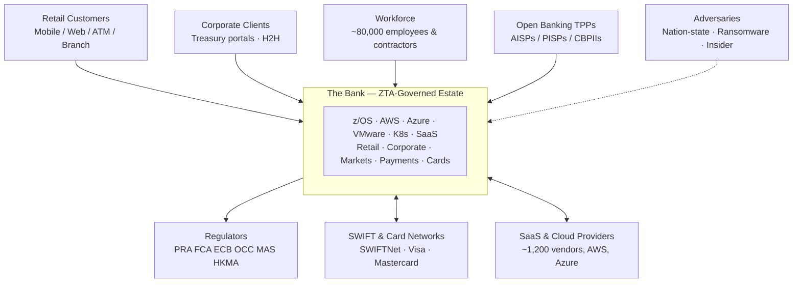
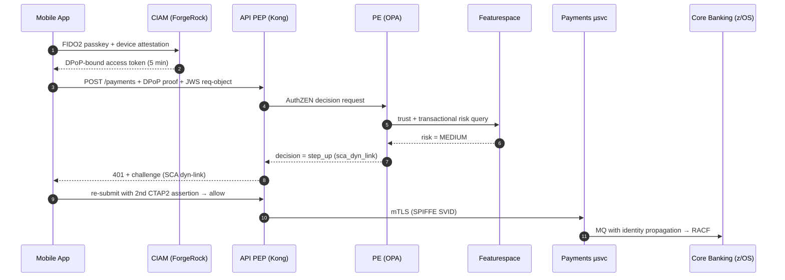

# Zero Trust Architecture — ARB Submission

**Document:** ZTA-2026-001
**Classification:** Restricted — ARB Only
**Author:** Security Solutions Architecture
**Version:** 1.0 · 2026-04-17
**Framework:** C4 × NIST SP 800-207

| | |
|---|---|
| **Estate** | z/OS · VMware · AWS · Azure · K8s · ~1,200 SaaS |
| **Population** | 80k staff · 25M retail · 400k corporate |
| **Jurisdictions** | EU · UK · US · APAC |
| **Quality Attributes** | Secure · Auditable · Observable |

---

## Contents

1. [Executive summary](#1-executive-summary)
2. [Assumptions & scope](#2-assumptions--scope)
3. [C4 Level 1 — Context](#3-c4-level-1--context)
4. [C4 Level 2 — Container](#4-c4-level-2--container)
5. [C4 Level 3 — Component](#5-c4-level-3--component)
6. [C4 Level 4 — Code](#6-c4-level-4--code)
7. [Component catalogue](#7-component-catalogue)
8. [Cross-cutting concerns](#8-cross-cutting-concerns)
9. [AI / ML use-case catalogue](#9-ai--ml-use-case-catalogue)
10. [Summary table](#10-summary--component--nist-role--vendor--regulation)
11. [Open questions & recommended PoCs](#11-open-questions-and-recommended-pocs)

---

## 1. Executive summary

The Group (hereafter **the Bank**) operates across the EU, UK, US and APAC with ~80,000 employees, ~25 million retail customers, ~400,000 corporate clients and a hybrid estate spanning `z/OS`, VMware, AWS (primary), Azure, on-prem Kubernetes and ~1,200 SaaS tenants. Implicit network trust is no longer defensible against credential theft, lateral movement and supply-chain compromise. Regulators (DORA, PRA SS1/21 and SS2/21, FFIEC AIO, MAS TRM, HKMA SA-2, APRA CPS 234) now expect continuous, identity-centric controls with demonstrable evidence. This submission proposes a NIST SP 800-207-aligned Zero Trust Architecture (ZTA) centred on a distributed Policy Engine (PE), a policy-as-code Policy Administrator (PA) and a heterogeneous mesh of Policy Enforcement Points (PEPs), fed by a normalised signal plane (identity, device posture, threat intel, UEBA, data classification, transactional risk).

Core design decisions:

1. **Identity as the control plane.** Workforce on Microsoft Entra ID federated with Okta Workforce; customers on ForgeRock CIAM with FAPI 2.0, DPoP-bound tokens and FIDO2 passkeys. Workload identity via SPIFFE/SPIRE issuing short-lived X.509 and JWT SVIDs to Kubernetes, VMs and serverless, bridged to `z/OS` via RACF digital-certificate mapping and a Kerberos-to-OIDC identity gateway.
2. **Decoupled AuthN and AuthZ.** Authentication assertions (OIDC ID Tokens, WebAuthn/CTAP2) are separated from fine-grained authorisation decisions evaluated by Open Policy Agent (OPA) and AWS Cedar at PEPs, using the *AuthZEN* wire protocol between PDP and PEP for interoperability across vendors.
3. **FAPI 2.0 for every high-assurance API.** PSD2 SCA dynamic linking is implemented through signed JWS request objects and `cnf`-bound access tokens; Open Banking endpoints are hardened against the UK OBIE, Berlin Group NextGenPSD2 and Brazil Open Finance profiles, with mTLS client authentication.
4. **Service mesh with mTLS everywhere.** Istio in AWS EKS and on-prem K8s; HashiCorp Consul bridges VM brownfield. Every east-west hop is mutually authenticated with SPIFFE SVIDs rotated every 60 minutes.
5. **Privileged and break-glass discipline.** CyberArk-driven PAM with just-in-time elevation, session recording and dual control; SWIFT Alliance Access, Payments Hub and card-issuing HSMs sit inside a CSCF v2024-compliant *Secure Zone* enforced by dedicated PEPs.
6. **AI in the loop, not in control.** UEBA, adaptive authentication, fraud/AML monitoring, SOC copiloting and policy-as-code review augment humans but never auto-remediate against customers. For red-team and SAST/DAST of the ZTA itself we recommend Anthropic's **Claude Mythos Preview** (restricted Project Glasswing preview, April 2026), with Claude Opus 4.7 on AWS Bedrock as the generally-available fallback.

The Policy Plane is classified as Tier-0 infrastructure with multi-region active-active redundancy, signed and versioned policy bundles, segregated-duty release, and an independent out-of-band "break-policy" path. The estimated delivery horizon is 36 months, phased against DORA Article 6 ICT risk framework milestones.

---

## 2. Assumptions & scope

The design assumes a 36-month transformation window with brownfield coexistence throughout. The following assumptions materially shape the architecture; any change to these invalidates the recommendations that follow.

- **Primary cloud.** AWS hosts ~60% of net-new workloads, Azure hosts Microsoft 365, Entra ID and select analytics, and GCP is confined to BigQuery for regulatory-reporting analytics. Multi-cloud parity is explicitly *not* a goal.
- **Mainframe.** `z/OS` LPARs remain authoritative for core deposit ledgers, the card-issuing platform and the general ledger. Decommissioning of the mainframe is out of scope; integration via the identity gateway and API facades is in scope.
- **Regulator set.** Primary supervisors are the PRA and FCA (UK), ECB and national competent authorities (EU), OCC, Federal Reserve and FDIC (US), MAS (SG), HKMA (HK) and APRA (AU). Secondary supervisors include state regulators in the US and DFSA in the UAE.
- **Out-of-scope.** The ZTA does not replace BC/DR, AML/KYC onboarding, card-issuing HSMs or the cheque-clearing infrastructure. It integrates with them as Data Sources and PEPs.
- **Post-quantum readiness.** Hybrid KEMs (ML-KEM + X25519) are a 2028 roadmap item, not day-one. The PKI and mTLS fabric must be crypto-agile (policy-driven algorithm selection).
- **Branch estate.** ~2,400 branches retain managed Windows endpoints; ATMs are treated as IoT with constrained profile-based PEPs.
- **Regulatory data residency.** EU personal data remains in Frankfurt and Dublin regions; UK data in London; Singapore data in ap-southeast-1; US data in us-east-1 and us-west-2. Cross-border flows are mediated by DLP-enforcing PEPs.
- **Skills.** SRE/platform teams are assumed to be proficient in Kubernetes and Terraform; OPA Rego authorship is a closing-gap skill requiring a Centre of Excellence.

> **Assumption that materially changes the design**
> If the mainframe becomes in-scope for decomposition, the identity-gateway sub-architecture expands materially and Kerberos bridging is replaced by direct SPIFFE issuance to RACF-mapped certificates. This would shorten some flows but adds a 12–18 month CICS refactor.

---

## 3. C4 Level 1 — Context

At Level 1 the Bank is treated as a single logical system surrounded by untrusted actors. Every arrow crosses a trust boundary; no network segment, including the corporate LAN, is trusted by default (NIST 800-207 §2.1 tenet 4, which denies implicit trust from location).



The diagram emphasises three distinct trust surfaces: **customer-to-Bank** (mobile, web, ATM), governed by CIAM and FAPI endpoints; **Bank-to-counterparty** (SWIFT, card networks, TPPs), governed by dedicated PEPs with higher-assurance authentication and cryptographic-identity binding; and **Bank-to-regulator**, where the Bank is usually the data publisher and therefore the flow direction is reversed — regulators pull evidence via attested, signed APIs. Adversaries are drawn explicitly to force every downstream design decision to answer "what does this look like if this actor is in the middle?".

Two internal trust boundaries not visible at L1 but critical at L2 are recorded here for continuity: the boundary between the *payments plane* (including SWIFT and card-issuing platforms) and the rest of the estate, and the boundary between *production* and *non-production*. Both are zero-trust boundaries in their own right and are enforced by different PEP populations.

---

## 4. C4 Level 2 — Container

Level 2 places concrete technology behind each NIST 800-207 logical role. The core triad (PE, PA, PEP) is instantiated as a distributed and horizontally scaled control plane; the Data Sources feeding the PE are a deliberate, named catalogue rather than an ad-hoc signal pool.

```mermaid
flowchart LR
    subgraph DS["Data Sources (NIST §3.2)"]
        cdm["CDM<br/>Tanium · Wiz · ServiceNow CMDB"]
        ti["Threat Intel<br/>Recorded Future · MISP"]
        sl["Activity Log / SIEM<br/>Splunk ES · Sentinel · Snowflake"]
        id["Identity Stores<br/>Entra · Okta · ForgeRock · SPIRE"]
        pki["PKI<br/>Venafi · AWS PCA · SPIFFE"]
        gov["Industry Compliance<br/>ServiceNow GRC · Archer"]
        dap["Data Access Policy<br/>Immuta · Privacera"]
        risk["Fraud / AML<br/>Featurespace · NICE Actimize"]
    end

    subgraph CP["NIST 800-207 Control Plane"]
        pe["Policy Engine<br/>OPA + Cedar fleet<br/>(PE / PDP)"]
        pa["Policy Administrator<br/>Signed bundle publisher<br/>(PA)"]
        ta["Trust Algorithm<br/>UEBA + device posture + risk<br/>AuthZEN wire protocol"]
    end

    subgraph PEP["Policy Enforcement Points"]
        api["API Gateway<br/>Kong · Apigee · Authlete FAPI"]
        mesh["Service Mesh Sidecar<br/>Istio · Consul Connect"]
        ztna["ZTNA / SASE<br/>Zscaler ZPA · Netskope"]
        mf["Mainframe Adapter<br/>Broadcom AAM · Vanguard"]
        db["Database Proxy<br/>CyberArk SDB · Satori"]
        casb["SaaS CASB<br/>Netskope · Zscaler ZIA"]
        pam["PAM Session Broker<br/>CyberArk PSM · BeyondTrust"]
        ai["AI Gateway<br/>Prompt-injection + egress PEP"]
    end

    subgraph ER["Enterprise Resources"]
        res["Subjects · Assets · Resources<br/>K8s · VM · Lambda · z/OS<br/>Data tiers 0–4 · APIs"]
        sz["Payments Secure Zone (CSCF v2024)<br/>SWIFT Alliance · Payments Hub · HSMs"]
    end

    DS --> CP
    CP -.signed bundles.-> PEP
    PEP --> ER
```



### Control-plane placement

The PE is implemented as a distributed OPA fleet (with AWS Cedar co-resident where Cedar's typed-policy strengths are needed, for example in the data-plane ABAC layer). PEs run as sidecars alongside each major PEP class to minimise policy-decision latency (<10 ms P99 target). The PA is a custom control-plane service that compiles, signs (cosign, in-toto attestation) and publishes OPA bundles and Cedar policy stores to the PE fleet over mutually authenticated channels. Policies are stored in Git with four-eyes review; the PA is the only component with write access to signed policy buckets (S3 Object Lock, Azure Blob immutability).

The Trust Algorithm component inside the control plane consumes streaming signals from all Data Sources via Kafka and produces a continuous `trust_score` per principal (workforce user, customer, workload) — this is the "continuous-diagnostics" feedback loop required by NIST 800-207 §2.1 tenet 7 and §3.3.1 (criteria-based trust algorithm). The score is emitted as a signed JWT claim consumed by PEPs via AuthZEN `context`.

### Data Sources

Eight Data Sources are catalogued (see catalogue in §7). The opinionated decision here is to treat the Data Access Policy store (Immuta) as a first-class, separate source rather than collapsing it into the PE, because data-plane ABAC operates on row/column predicates rather than request-scope policies and scales independently. Fraud/AML scoring is separated from the general UEBA pipeline; mixing the two leads to false positives on high-value corporate flows (Basel III ORM evidence shows commercial payment behaviour has a heavier tail than retail).

### PEPs

PEP diversity is intentional. A single PEP class cannot reasonably enforce identity for HTTP APIs, east-west gRPC, mainframe CICS transactions, SaaS SAML sessions, privileged SSH, database reads and LLM prompt flow. Each class exists because the protocol semantics require dedicated enforcement; each terminates identity, consults the PE via AuthZEN, and writes a structured audit event to the activity log.

---

## 5. C4 Level 3 — Component

### Flow A — Retail customer logging in to Mobile Banking and initiating a payment



1. **Device attestation and passkey.** At app launch, the mobile client performs Google Play Integrity or Apple App Attest, producing a signed device posture assertion bound to a device-local FIDO2 credential stored in the Secure Enclave/StrongBox. The user authenticates with a resident-key passkey unlocked by platform biometrics. This satisfies PSD2 SCA (two independent factors: possession of the device-bound private key plus inherence via biometric) and is phishing-resistant (CTAP2 with attested authenticators). *NIST 800-207 §2.1 tenet 6 — dynamic authentication and strict enforcement per resource.*
2. **OIDC hybrid flow to ForgeRock CIAM.** The CIAM issues a short-lived (5-minute) access token bound to a DPoP proof-of-possession key (RFC 9449), with a `cnf` claim carrying the JWK thumbprint. An ID Token is issued alongside, signed by a CIAM signing key rooted in a cloud HSM.
3. **Payment API call.** The app calls `POST /v2/payments` at the Kong FAPI PEP, sending the DPoP proof JWT and a signed JWS request object containing `amount`, `payee`, `timestamp` — the PSD2 SCA dynamic-linking digest. Kong validates token signature, audience, expiry, DPoP binding, mTLS client certificate (OAuth 2 mTLS-bound tokens per RFC 8705 for corporate API paths), and request-object signature against the CIAM JWKS.
4. **AuthZEN decision request.** Kong sends an AuthZEN `/access/v1/evaluation` request to the local OPA PE with `subject`, `resource`, `action` and a rich `context` including device posture, CIAM trust score and request metadata.
5. **Continuous risk scoring.** OPA calls the Featurespace risk API (also a data source) for a transactional-risk score using adaptive behavioural analytics (device, geo-velocity, amount-versus-baseline).
6. **Decision.** With a medium risk score and an unseen payee, OPA returns `{decision: "step_up", obligations: ["push_authn", "sca_dyn_link"]}`. The decision, the signal vector and the policy bundle hash are written to the immutable audit log (Splunk + S3 Object Lock in WORM mode).
7. **Step-up.** Kong returns 401 with the obligation; the app prompts the user for a second biometric confirming the dynamic-linking digest (amount + payee hash), producing a second CTAP2 assertion.
8. **Re-submission and allow.** The request is re-evaluated; OPA returns `{decision: "allow"}`. Kong routes to the Payments microservice over the Istio mesh; the sidecar Envoy mTLS handshake uses SPIFFE SVIDs with spiffe-IDs `spiffe://bank/retail/payments-api` and `spiffe://bank/retail/payments-service`.
9. **Core-banking propagation.** The microservice posts to an MQ queue whose consumer is a `z/OS` CICS transaction; the identity token is propagated as an MQ message header and mapped via the identity gateway to a RACF ID. The mainframe PEP (Broadcom AAM) validates the mapped ID and transaction scope before the CICS transaction commits.
10. **Evidence.** Every step emits an OpenTelemetry span with `trace_id`, `policy_bundle_hash`, `decision_id` and `signal_hash`. The full causal chain is reconstructable from the activity log for the SOX §404 evidence pack.

### Flow B — Back-office workload calling the SWIFT gateway

1. **Workload identity.** A Settlement batch microservice in the Payments EKS cluster requests a workload identity from the SPIRE Agent on the node via the SPIFFE Workload API. SPIRE validates the K8s ServiceAccount, namespace, node attestation (AWS instance-identity document) and issues a short-lived X.509 SVID with URI SAN `spiffe://bank/payments/settlement`, TTL 15 minutes.
2. **Outbound call.** The service calls the internal SWIFT facade at `swift-gw.payments.svc`. The Istio sidecar establishes mTLS with the facade using the SVID.
3. **Secure Zone ingress PEP.** The facade sits inside the SWIFT Secure Zone (CSCF v2024 control 1.1 "SWIFT environment protection"). A dedicated PEP terminates mTLS, validates the SVID against an allow-list of spiffe-IDs permitted to speak SWIFT, and queries the PE.
4. **Policy evaluation.** OPA evaluates: (a) is the SVID in the SWIFT allow-list, (b) is the request within the permitted time window (batch 22:00–02:00 UTC), (c) is there a dual-control approval token from the payments-ops team (CSCF control 6.4 "Logging and Monitoring" plus in-house dual-auth), (d) is the message type permitted (e.g., MT103 customer transfer, or pacs.008 ISO 20022). A signed decision is issued.
5. **SWIFT Alliance Access.** The facade forwards to the SWIFT Alliance Access server; SWIFTNet link encryption and HSM-signed local authentication apply. All access to the Alliance HMI is broker-mediated by CyberArk PSM with session recording (CSCF control 5.1).
6. **Break-glass.** If the allow-list misses a legitimate case (e.g., disaster-recovery cutover), the operator raises a CyberArk JIT request. Dual human approval is required. The ticket number is injected into the policy context; OPA permits the call only with a valid break-glass claim, and the session is recorded to WORM storage with a 10-year retention SOX tag.
7. **Evidence.** The chain of evidence is: SPIRE SVID issuance log → Istio access log → PEP AuthZEN record → OPA decision log → Alliance Access audit → CyberArk session video. Each artefact is cross-indexed by the SWIFT `UETR` (Unique End-to-end Transaction Reference) for reconciliation.

Flow B illustrates the *machine identity* dimension of ZTA with no human in the hot path, combined with strong human-in-the-loop controls on exceptions. It is also the regulatory showcase: every artefact maps to a CSCF v2024 control and a SOX ICFR assertion.

---

## 6. C4 Level 4 — Code

The following is a simplified fragment of the policy that fires in step 6 of Flow A. It is illustrative, not production-ready; the real policy is split into reusable modules under `policies/retail/payments/` with unit tests (`opa test`) and a policy-bundle signer.

```rego
package retail.payments.authorisation

# --- inputs (from AuthZEN evaluation request) -----------------------
# input.subject      : { id, type, trust_score, auth_methods, device }
# input.resource     : { type: "payment", scope: "domestic" | "sepa" | "swift" }
# input.action       : { name: "create", amount: number, currency, payee }
# input.context      : { risk: { score, reasons }, device_posture,
#                         sca: { dyn_link_digest, factors }, geo, time }
# input.env          : { policy_bundle_hash, region, jurisdiction }

default decision := {"effect": "deny", "reason": "default-deny"}

# Allow clearly low-risk same-payee transfers below threshold
decision := {"effect": "allow", "obligations": []} {
  input.subject.trust_score >= 0.85
  input.context.risk.score <= 0.2
  input.action.amount <= threshold[input.action.currency]
  known_payee
  sca_satisfied
  not jurisdictional_block
}

# Step up when risk is medium or trust is soft
decision := {"effect": "step_up",
             "obligations": ["push_authn", "sca_dyn_link"]} {
  input.context.risk.score > 0.2
  input.context.risk.score <= 0.7
}

# Hard deny: sanctions, PSD2 dyn-link mismatch, device jailbreak,
#            or policy-bundle integrity unknown
decision := {"effect": "deny", "reason": reason} {
  reason := deny_reason
}

deny_reason := "sanctions-hit"         { sanctions.match(input.action.payee) }
deny_reason := "sca-dyn-link-mismatch" { not dyn_link_ok }
deny_reason := "device-tampered"       { input.context.device_posture.tampered }
deny_reason := "untrusted-bundle"      { not data.env.trusted_bundles[input.env.policy_bundle_hash] }
deny_reason := "jurisdiction-block"    { jurisdictional_block }

# Helpers
known_payee { input.context.payee.seen_before }

sca_satisfied {
  count(input.context.sca.factors) >= 2
  input.context.sca.factor_categories == {"possession", "inherence"}
}

dyn_link_ok {
  h := crypto.sha256(sprintf("%v|%v|%v",
          [input.action.amount, input.action.payee, input.action.nonce]))
  h == input.context.sca.dyn_link_digest
}

threshold := {"EUR": 15000, "GBP": 15000, "USD": 15000, "SGD": 20000}

jurisdictional_block {
  input.env.jurisdiction == "EU"
  input.action.payee.country == "RU"
}

# Obligation: emit an audit record regardless of effect
audit := {
  "decision_id": uuid.rfc4122("a6e7..."),
  "bundle":      input.env.policy_bundle_hash,
  "subject":     input.subject.id,
  "resource":    input.resource,
  "effect":      decision.effect,
  "signals":     hash_sig(input.context),
  "ts":          time.now_ns(),
}
```

Observations for ARB review: the policy is *contextual* (every decision reads `context`), *composable* (helpers are individually unit-testable), *fail-closed* (`default decision := deny`), and *self-auditing* (`audit` is emitted as an obligation regardless of effect). The `policy_bundle_hash` is verified against a list of *trusted bundles* — an explicit supply-chain control on the policy itself. A Cedar equivalent for the data-plane (row/column ABAC on Snowflake and S3) exists in a separate module; Cedar's type system catches policy class errors that Rego allows.

---

## 7. Component catalogue

Each component is summarised against the five-point template: rationale/tenet, NIST role, vendor options, regulatory alignment and real-world reference. Where no financial-institution public case exists we name the closest analogue rather than fabricate.

### 7.1 ForgeRock CIAM — Identity Data Source

- **Rationale.** Consumer-scale identity with progressive-profiling, risk-based auth, OIDC/FAPI 2.0 issuance and WebAuthn/passkey support. Satisfies NIST 800-207 §2.1 tenets 3 and 6 (per-session, dynamic authentication).
- **NIST role.** Identity Data Source; co-operates with PE as a continuous-signal emitter.
- **Vendors.** *Commercial:* ForgeRock (Ping), Auth0/Okta CIC. *Open source:* Keycloak with Authlete FAPI module — cheaper, less feature-rich for fraud-aware journeys. Recommend ForgeRock for retail and Keycloak+Authlete for TPPs and internal partner federation.
- **Regulation.** PSD2 RTS on SCA (Articles 4, 5, 9), Open Banking UK OBIE conformance, DORA Art. 9 (ICT protection). PCI-DSS 4.0 req 8 (user authentication) for card-controls paths.
- **Reference.** No single public bank case; ForgeRock's public reference architectures for Nationwide Building Society and Standard Chartered (vendor-confirmed) are the closest FI analogues.

### 7.2 Microsoft Entra ID (Workforce) — Identity Data Source

- **Rationale.** Authoritative workforce directory, tight integration with Microsoft 365 and Conditional Access. Issues OIDC tokens consumed by PEPs and provides a rich posture signal (device compliance via Intune). NIST 800-207 §2.1 tenet 7 (continuous monitoring of user and device).
- **NIST role.** Identity Data Source; Conditional Access engine is effectively a per-application PDP.
- **Vendors.** *Commercial:* Entra ID, Ping Identity. *Open source:* FreeIPA/Keycloak — viable for bridging, not authoritative at 80k-staff scale. Recommend Entra ID given Microsoft 365 saturation.
- **Regulation.** SOX §404 ICFR (privileged access evidence), FFIEC AIO booklet, PCI-DSS 4.0 req 8.3 MFA, DORA Art. 9.
- **Reference.** Capital One and Standard Chartered public Entra + Conditional Access implementations. CISA ZTMM "Identity" pillar maturity guidance is the closest policy analogue.

### 7.3 Okta Workforce (Federation Broker) — Identity DS / SaaS PEP

- **Rationale.** SaaS federation hub for ~1,200 applications. Reduces the fan-out of trust relationships from the workforce IdP to one broker. Enforces session-risk and device-trust at SaaS ingress.
- **NIST role.** Secondary Identity Data Source; acts as a PEP for SaaS sessions in cooperation with Netskope CASB.
- **Vendors.** Okta (recommended), Ping Federate (equivalent), Keycloak (open source, higher operational cost for 1,200 SaaS integrations).
- **Regulation.** DORA Art. 28 (ICT third-party risk), SOX §404 evidence for SaaS access, FFIEC Outsourcing booklet.
- **Reference.** HSBC and NAB have publicly referenced Okta for large-scale workforce federation.

### 7.4 SPIFFE / SPIRE — Workload Identity

- **Rationale.** Cryptographically verifiable, short-lived workload identities across K8s, VMs and AWS Lambda. Eliminates long-lived service-account secrets. NIST 800-207 §2.1 tenet 2 (security of all resources regardless of location) applied to services.
- **NIST role.** Identity Data Source for workloads; issuer for the workload-PKI used by PEPs.
- **Vendors.** *Open source:* SPIRE (CNCF graduated). *Commercial:* HPE SPIFFE/SPIRE, Tetrate Service Bridge. Recommend SPIRE with commercial support from Tetrate or HPE given bank-scale SLAs.
- **Regulation.** DORA Art. 9 (including non-human identities under ICT risk management), NIST 800-207 §3.1.3.
- **Reference.** Bloomberg's SPIRE deployment is public (2022 CNCF talk). Closest FI-adjacent analogue; major banks have not publicly disclosed SPIRE use but several are known implementers.

### 7.5 Open Policy Agent (PE) — Policy Engine

- **Rationale.** The PE of choice — declarative Rego, deterministic evaluation, sub-millisecond P99 at sidecar scale, bundle-based signed distribution. AuthZEN-capable.
- **NIST role.** Policy Engine (per §3.1.1).
- **Vendors.** *Open source:* OPA (recommended). *Commercial:* Styra DAS for centralised policy management; AWS Cedar + Verified Permissions for typed data-plane policies. Recommend OPA-as-sidecar with Styra DAS for enterprise distribution, Cedar for row/column data policy.
- **Regulation.** Every access decision must be reproducible for SOX §404 and DORA Art. 6. OPA's decision log with bundle hash is the canonical evidence.
- **Reference.** Goldman Sachs and Capital One have public OPA deployments at scale (KubeCon 2023, AWS re:Invent 2022).

### 7.6 Policy Administrator — Control Plane

- **Rationale.** The PA compiles, tests, signs (cosign, in-toto) and publishes policy bundles to the PE fleet. Enforces segregation of duties — no single engineer can push policy to production. Direct execution of NIST 800-207 §2.1 tenet 5.
- **NIST role.** Policy Administrator.
- **Vendors.** *Commercial:* Styra DAS. *Open source:* GitOps-driven (Argo CD + OPA bundle server). Recommend Styra DAS because the bank's policy fleet will exceed 10k bundles.
- **Regulation.** SOX §404 change-control evidence; DORA Art. 8 (ICT change management).
- **Reference.** CISA ZTMM prescribes a dedicated policy administration function in its "Governance" cross-cut.

### 7.7 API Gateway (Kong + FAPI module) — PEP

- **Rationale.** North-south API enforcement for retail, corporate and Open Banking. Validates tokens, DPoP, mTLS binding, request-object signing, rate limits, bot defence.
- **NIST role.** PEP.
- **Vendors.** *Commercial:* Apigee, Kong Enterprise, Authlete (FAPI specialist). *Open source:* Kong OSS + APISIX. Recommend Kong Enterprise with Authlete as the OAuth/FAPI engine for Open Banking endpoints.
- **Regulation.** PSD2 RTS Art. 34 secure communication (eIDAS QWACs), UK OBIE conformance, FAPI 2.0 Security Profile, Berlin Group NextGenPSD2, Brazil Open Finance.
- **Reference.** Santander UK and ING publicly run API-led Open Banking programmes; Authlete is the OBIE reference implementation for FAPI.

### 7.8 Istio Service Mesh — PEP (east-west)

- **Rationale.** mTLS with SPIFFE SVIDs, per-request authorisation via Envoy external AuthZ calling OPA, structured access logs. Covers every east-west hop in K8s.
- **NIST role.** PEP for service-to-service traffic; cooperates with SPIRE.
- **Vendors.** *Open source:* Istio (recommended), Linkerd (simpler, fewer features). *Commercial:* Tetrate Service Bridge for multi-cluster federation.
- **Regulation.** DORA Art. 9, NIST 800-207 §3.1.2 micro-segmentation model.
- **Reference.** eBay, Airbnb and Splunk Istio-at-scale references; Deutsche Bank Istio talks at KubeCon EU 2023.

### 7.9 Zscaler Private Access (ZTNA) — PEP

- **Rationale.** Replaces legacy VPN. Per-application tunnels brokered against identity and device posture, with no lateral visibility of internal networks.
- **NIST role.** PEP for workforce access to internal apps.
- **Vendors.** *Commercial:* Zscaler ZPA (recommended), Cloudflare Access, Netskope Private Access. *Open source:* OpenZiti.
- **Regulation.** DORA Art. 9, PCI-DSS 4.0 req 7 (least privilege) for CDE access paths.
- **Reference.** CISA ZT guidance endorses ZTNA over VPN; MAS TRM Guidelines §9 remote-access.

### 7.10 CyberArk PAM — Privileged Access

- **Rationale.** JIT elevation, session recording and vaulted credentials for Tier-0 and payments systems. Break-glass gateway into SWIFT Alliance, HSMs and the Payments Hub.
- **NIST role.** PEP for privileged sessions; Identity Data Source for privileged events.
- **Vendors.** *Commercial:* CyberArk (recommended), BeyondTrust, Delinea. *Open source:* Teleport (credible at this scale).
- **Regulation.** SWIFT CSCF v2024 controls 1.2, 5.1, 6.4; PCI-DSS 4.0 req 7, 8.6; SOX §404 segregation of duties.
- **Reference.** CyberArk case studies with three of the four major UK clearing banks (vendor-attributed).

### 7.11 HashiCorp Vault + nCipher/AWS CloudHSM — Secrets

- **Rationale.** Dynamic secrets for databases, cloud APIs and certificates; HSM-rooted signing for high-assurance keys (CIAM, FAPI JWS signer, eIDAS QWAC issuance). BYOK/HYOK for AWS KMS and Azure Key Vault.
- **NIST role.** Supporting infrastructure; also a PKI Data Source.
- **Vendors.** *Commercial:* Vault Enterprise, Thales CipherTrust, Entrust KeyControl. *Open source:* Vault OSS. HSMs: nCipher nShield, Thales Luna, AWS CloudHSM (FIPS 140-3 Level 3).
- **Regulation.** PCI-DSS 4.0 req 3 (protect stored data), FIPS 140-3, DORA Art. 9, eIDAS 2 QTSP requirements.
- **Reference.** ING's Vault-at-scale talk (HashiConf 2021) and JPMorgan cloud HSM references.

### 7.12 Splunk ES + Snowflake Security Lake — SIEM

- **Rationale.** Real-time detection in Splunk ES; long-term, cost-efficient retention and analytics in Snowflake. Every PEP decision and identity event indexed by `trace_id` and `decision_id`.
- **NIST role.** Activity Log and SIEM Data Sources.
- **Vendors.** *Commercial:* Splunk ES, Microsoft Sentinel, Google Chronicle. *Open source:* Elastic Security, Wazuh + OpenSearch. Recommend a federated Splunk-for-detection, Snowflake-for-retention pattern to manage licence cost.
- **Regulation.** SOX §404 (7-year audit trail), DORA Arts. 10–11 (detection and reporting), PCI-DSS 4.0 req 10 (log and monitor).
- **Reference.** Bank of America and Barclays have publicly discussed Splunk+Snowflake security-lake patterns at industry events.

### 7.13 OpenTelemetry + Grafana/Dynatrace — Observability

- **Rationale.** Single vendor-neutral telemetry pipeline: traces, metrics, logs. PEP decision latency SLO (P99 < 10 ms) requires tight instrumentation.
- **NIST role.** Activity Log Data Source; also observability of PE/PA health.
- **Vendors.** *Open source:* OpenTelemetry Collector + Grafana. *Commercial:* Dynatrace, Datadog. Recommend OTel standard with Dynatrace for platform-level APM.
- **Regulation.** DORA Art. 10 (detection), FFIEC Operations Handbook (monitoring).
- **Reference.** Lloyds Banking Group's OTel adoption talks.

### 7.14 Wiz (CNAPP) + Tanium (Endpoint) — CDM

- **Rationale.** CDM signal feeds (vulnerability, configuration drift, exposure, compliance) to the PE. Tanium covers endpoints; Wiz covers cloud workloads and IaC.
- **NIST role.** Continuous Diagnostics and Mitigation (CDM) Data Source.
- **Vendors.** *Commercial:* Wiz, Prisma Cloud, Orca. Tanium vs CrowdStrike Falcon. *Open source:* OpenVAS + osquery (gaps at scale). Recommend Wiz + Tanium combination.
- **Regulation.** DORA Art. 9, PCI-DSS 4.0 req 11 (vulnerability management), CISA ZTMM.
- **Reference.** Published case studies are largely in insurance and tech; FI analogues exist but are not public. CISA BOD 23-01 prescribes CDM for federal agencies.

### 7.15 Venafi TLS Protect + AWS Private CA — PKI

- **Rationale.** Enterprise certificate lifecycle including discovery, rotation and policy across on-prem and cloud CAs. SPIFFE SVIDs handle the workload-PKI layer; Venafi covers the long-lived enterprise layer.
- **NIST role.** PKI Data Source / supporting infrastructure.
- **Vendors.** *Commercial:* Venafi, AppViewX. *Open source:* cert-manager, smallstep CA. Recommend Venafi for eIDAS and enterprise TLS; cert-manager for K8s ingress.
- **Regulation.** eIDAS QWAC issuance (PSD2 SCA Art. 34), PCI-DSS 4.0 req 4 (cryptography), DORA Art. 9.
- **Reference.** Fannie Mae and USAA public case studies with Venafi.

### 7.16 Immuta — Data-plane ABAC

- **Rationale.** Row/column ABAC for Snowflake, Databricks and S3. Classification-driven policies; dynamic masking by subject purpose.
- **NIST role.** Data Access Policy Data Source; also a data-plane PEP.
- **Vendors.** *Commercial:* Immuta (recommended), Privacera, Okera. *Open source:* Apache Ranger (narrower Hadoop/Hive scope).
- **Regulation.** GDPR (purpose limitation), EU AI Act (training-data governance), BCBS 239 data aggregation principles.
- **Reference.** Commonwealth Bank of Australia's Immuta references.

### 7.17 Netskope SSE (CASB + SWG + DLP) — PEP

- **Rationale.** Inline control of SaaS sessions and DLP for data-in-motion. Needed because ~1,200 SaaS tenants cannot all be placed behind API gateways.
- **NIST role.** PEP for SaaS and egress paths; DLP Data Source.
- **Vendors.** *Commercial:* Netskope (recommended), Zscaler ZIA, Palo Alto Prisma Access. *Open source:* none at feature parity.
- **Regulation.** DORA Art. 28 (TPP), GDPR data-flow control, PCI-DSS 4.0 req 12.8 (service providers).
- **Reference.** UK NCSC ZT principles §SSE; several large US banks are public Netskope customers.

### 7.18 Authlete (FAPI 2.0 Engine) — API

- **Rationale.** Reference-implementation of FAPI 2.0, CIBA, Pushed Authorisation Requests (PAR) and JARM, behind Kong. Gets the OAuth engine right so Kong focuses on enforcement.
- **NIST role.** Supporting infrastructure beneath the FAPI PEP.
- **Vendors.** *Commercial:* Authlete (recommended), Curity, ForgeRock AM. *Open source:* Keycloak with FAPI extensions (gaps).
- **Regulation.** FAPI 2.0 Security Profile, UK OBIE, Berlin Group, Brazil Open Finance, PSD2.
- **Reference.** UK OBIE's reference conformance suite uses Authlete; Banco do Brasil public FAPI reference.

### 7.19 Broadcom Advanced Authentication Mainframe — z/OS PEP

- **Rationale.** Bridges modern OIDC/Kerberos identities into RACF IDs with Kerberos constrained delegation and digital-certificate mapping. Enables ZTA for `z/OS` without rewriting CICS transactions.
- **NIST role.** PEP for mainframe; Identity Gateway.
- **Vendors.** *Commercial:* Broadcom AAM (recommended), Vanguard Integrity, IBM z Multi-Factor Authentication. *Open source:* none practical.
- **Regulation.** SOX §404 (core ledger controls), PCI-DSS 4.0 (cardholder data on mainframe).
- **Reference.** US Federal Reserve, Wells Fargo and Barclays publicly run mainframe MFA programmes.

### 7.20 Featurespace ARIC (Transaction Risk) — AI

- **Rationale.** Adaptive behavioural analytics producing per-transaction fraud and AML risk scores consumed by the PE and step-up policy.
- **NIST role.** Continuous-signal Data Source for the PE.
- **Vendors.** *Commercial:* Featurespace (recommended), NICE Actimize, SAS Fraud Management. *Open source:* none close to FI-grade.
- **Regulation.** PSD2 Art. 2 transaction risk analysis, 5AMLD/6AMLD, FFIEC BSA/AML.
- **Reference.** TSYS, HSBC and Worldpay public Featurespace deployments.

---

## 8. Cross-cutting concerns

### 8.1 Human identity

Three distinct identity populations are served by three specialised planes: **workforce** (Entra ID + Okta Workforce), **customer** (ForgeRock CIAM), and **partner B2B** (Keycloak-based federation broker accepting SAML, OIDC and SPIFFE). Workforce and CIAM are deliberately *not* collapsed — they have incompatible regulatory envelopes (GDPR data-subject rights for customers, employment law for staff), different scale characteristics (25M customers vs 80k staff), and different UX budgets (friction-averse retail vs strong-MFA workforce). A shared signal layer (UEBA, device trust) is normalised into AuthZEN context before reaching the PE. Third-party partners federate via the B2B broker using SAML 2.0 for legacy counterparties and OIDC FAPI-CIBA for decoupled approval flows (for example, a corporate treasurer initiating a payment approved by the CFO on a separate device).

### 8.2 Machine and workload identity

SPIFFE IDs are the canonical workload identity across Kubernetes, VMs (via SPIRE agent), AWS Lambda (via SPIRE OIDC federation + AWS STS), and the mainframe through certificate mapping. SVIDs are 15-minute X.509 certificates for mTLS and 5-minute JWT SVIDs for gRPC/HTTP bearer use. **Attestation** chains: SPIRE uses node attestation plugins (AWS instance-identity, GCP instance-identity, K8s PSAT, x509 POP for VMs) and workload attestation plugins (K8s ServiceAccount, Unix UID, SELinux label) so an SVID represents a *provably-this-workload* identity rather than just "something on this node". Long-lived service-account secrets and cloud-access keys are prohibited for net-new workloads; discovery and eradication runs as a continuous Wiz + Vault control.

### 8.3 Secrets management

HashiCorp Vault centralises secrets with dynamic generation (short-lived database credentials, one-time AWS STS sessions), transparent rotation, transit encryption-as-a-service, and PKI issuance. Integration with nCipher nShield or AWS CloudHSM provides FIPS 140-3 Level 3 roots for the CIAM signing keys, FAPI JWS signers, eIDAS QWAC issuance and card-issuing key ceremonies. **BYOK and HYOK** patterns apply to tenant data in AWS KMS and Azure Key Vault: the bank retains HSM-backed master keys and wraps cloud-provider keys, giving cryptographic evidence of control to EU supervisors under DORA Article 9(4). A dedicated secrets-zero initiative tracks long-lived secret inventory to zero by end of phase 2.

### 8.4 Privileged Access Management (PAM)

CyberArk PAM provides vaulted credentials, just-in-time elevation, session brokering and recording. The ZTA principle is that a privileged user is not trusted merely because they are a privileged user — every action is a new authorisation decision. For SWIFT and the Payments Hub the PAM session broker is itself a PEP: the operator authenticates to PSM with FIDO2, PSM requests a fresh PE decision with session context (change window, CAB ticket, dual-approval token), and only then opens an RDP/SSH channel to the jump host, which is recorded end-to-end. Break-glass paths are pre-signed and time-limited; use triggers an out-of-band page to the CISO and an automatic Jira incident.

### 8.5 Logging, audit trail and SIEM

Every PEP emits a structured event with a minimum schema: `trace_id`, `decision_id`, `bundle_hash`, `subject_id`, `resource`, `action`, `effect`, `obligations`, `signal_hash`, `ts`. Events stream via OpenTelemetry Collector to Kafka, then to Splunk ES for detection and Snowflake for retention. Retention is 7 years for SOX-relevant events in S3 Object Lock (WORM) and 10 years for SWIFT CSCF and payments. An optional **blockchain-anchored** hash-chain (e.g., AWS QLDB with quarterly anchor to a public chain) is recommended for adversarial-auditor scenarios; the ARB should weigh this against reputational exposure of public-chain inclusion. The SOX §404 evidence workflow reconstructs every production access from the PEP log by `decision_id`; sample-based testing is replaced by deterministic replay of the policy bundle against the stored signal vector.

### 8.6 Observability

OpenTelemetry is the sole instrumentation standard. Metrics, traces and logs are correlated by `trace_id`. Key SLOs for the Policy Plane: PEP-to-PE decision latency P99 < 10 ms in-region; PE availability 99.995% (Tier-0); policy-bundle propagation latency P99 < 60 s; decision-log loss rate < 10⁻⁶. Dashboards surface per-policy allow/deny/step-up rates, unusual deny spikes (likely policy regression), and "decisions-per-user" anomaly bands. Error budgets are tracked against these SLOs; exhaustion freezes non-emergency policy releases.

### 8.7 API security

Every external API adopts FAPI 2.0 Security Profile. Specifically: **PAR** (RFC 9126) prevents request-parameter tampering; **DPoP** (RFC 9449) binds access tokens to a client key, preventing replay; **mTLS-bound tokens** (RFC 8705) for corporate and payment-initiation paths; **JARM** for signed authorisation responses; **JWS request objects** carrying the PSD2 SCA dynamic-linking digest. Rate limiting and bot defence run at Kong (Arkose Labs or hCaptcha for high-risk endpoints). For FAPI-CIBA decoupled flows (e.g., corporate treasurer initiating, CFO approving), the authorisation server uses push-notification with a signed approval JWT. Internal APIs use the same gateway but with relaxed profiles; all still require tokens (no anonymous internal endpoints, honouring NIST 800-207 §2.1 tenet 2).

### 8.8 Data protection

Data classification is a five-tier model (Public, Internal, Confidential, Restricted, Secret) driving policy. Card-data PANs are tokenised at ingest by a Thales CipherTrust tokenisation vault; the PCI-DSS scope is contracted to the vault and the card-issuing HSM cluster. Format-preserving encryption (FF3-1) protects legacy systems that cannot handle tokens. Database proxies (CyberArk Secure DB Access) and Immuta policies enforce row/column ABAC at the data plane. DLP runs at SaaS egress (Netskope) and at API PEPs. **Post-quantum readiness** is staged: (i) crypto-inventory (Venafi + bespoke scanner) by end-phase 1; (ii) hybrid KEM trial (ML-KEM-768 + X25519) on internal mTLS in phase 2; (iii) FAPI PQ profile once standardised (~2028).

### 8.9 Third-party and supply-chain risk

DORA Article 28 requires an ICT third-party register and concentration-risk analysis. The ZTA contributes: every third-party interaction terminates at a PEP that records a structured event tagged with the TPP register ID, supporting both reporting and exit-plan testing. For supply-chain integrity of internal builds the bank adopts **sigstore** (cosign, fulcio, rekor) with **in-toto** attestations for provenance. SBOMs (SPDX 3) are generated per build and ingested into Wiz for vulnerability correlation. Policy bundles are themselves signed and verified by the PE at load time; an invalid or unknown bundle causes fail-closed denial (see `untrusted-bundle` in the Rego example above).

### 8.10 Threat model of the ZTA itself

A STRIDE walk against the PE, PA and PEP reveals the following top-tier risks and their mitigations:

- **Spoofing of PEs or PAs:** PEs verify PA bundle signatures against a root of trust held in an HSM; PAs accept policy only over mTLS from signed-commit Git operators. Unsigned or unknown-signer bundles fail closed.
- **Tampering with signals:** Data Source feeds are authenticated (mTLS + SVID) and cryptographically chained into the decision-log (`signal_hash` in the audit record). Tampering is detectable at replay.
- **Repudiation:** Decision logs are WORM-anchored. The hash-chain architecture prevents retroactive edit.
- **Information disclosure:** Policies may embed sensitive predicates (limits, sanctions lists). Policy bundles are encrypted at rest and access-audited; debug logs redact `input`.
- **Denial of Service of the policy plane:** PEs are locally cached at each PEP with short TTL and "last-known-good" semantics; under PE outage the PEP fails closed for high-risk resources and fails-safe-with-reduced-capability for low-risk resources (e.g., permit read-only). Multi-region active-active PE/PA.
- **Elevation via policy regression:** Every policy change goes through signed CI with opa-test, policy-diff review, staged rollout to canary PEs, and automated rollback on allow-rate anomaly. Policy-as-code review is augmented by Claude Mythos Preview (see §9) or Claude Opus 4.7 as a GA fallback.

The single gravest systemic risk is the Policy Plane becoming the target. We therefore treat PE and PA as Tier-0 alongside PKI and the core ledger, with separate admin identities, independent out-of-band MFA, and dedicated network fabric (not on the same east-west mesh it governs).

---

## 9. AI / ML use-case catalogue

AI is not a cross-cutting sprinkle. Each use case below specifies the signal consumed, the decision informed, the NIST 800-207 component augmented, the false-positive tolerance and the human-in-the-loop control. Across all use cases the **AI Gateway PEP** enforces prompt-injection defence (content classifiers, deterministic filters, signed system prompts) and data-egress prevention (DLP on prompts and responses).

### 9.1 UEBA as continuous-trust signal

| Aspect | Detail |
|---|---|
| **Signal** | Workforce session telemetry (auth events, app telemetry, endpoint signals) normalised into behavioural baselines. |
| **Decision** | Continuous `trust_score` (0–1) consumed by the PE as a first-class input to step-up and revocation policies. |
| **NIST component** | Augments the Trust Algorithm inside the PE (§3.3.1). |
| **Models** | Microsoft Defender for Identity, Exabeam, or custom isolation-forest + sequence models on Databricks. |
| **FP tolerance** | Medium — a FP triggers step-up, not block. Target <0.5% false step-up rate; tuned per role cohort. |
| **HITL** | Score >0.9 (high-severity) routes to SOC Tier-2 for review; never auto-disables workforce accounts. |

### 9.2 Adaptive / risk-based authentication

| Aspect | Detail |
|---|---|
| **Signal** | Device posture, geo-velocity, behavioural biometrics (typing, swipe), CIAM risk engine outputs. |
| **Decision** | Step-up or friction-reduction at CIAM sign-in and at high-value actions. |
| **NIST component** | Augments Identity Data Source and informs the PE at session and transaction time. |
| **Models** | BioCatch or LexisNexis ThreatMetrix; ForgeRock's native risk engine for lower-risk journeys. |
| **FP tolerance** | Low for block, medium for step-up. PSD2 TRA exemption requires <0.13% fraud rate bracket for unattended flow — constrains model tuning. |
| **HITL** | No auto-block on unattended retail flows; fraud-ops reviews borderline step-ups daily. |

### 9.3 Fraud and AML monitoring at API PEPs

| Aspect | Detail |
|---|---|
| **Signal** | Transaction metadata (amount, payee, corridor), device, CIAM session, counterparty graph (Featurespace ARIC). |
| **Decision** | Real-time fraud/AML score returned to the PE; trigger for SAR filing in downstream AML (Actimize). |
| **NIST component** | Data Source consumed by PE; PEP enforces. |
| **Models** | Featurespace adaptive behavioural analytics; graph-neural-network counterparty models on Databricks. |
| **FP tolerance** | Very low for AML (regulatory exposure of both over-reporting and under-reporting). Targets set with MLRO and FATF alignment. |
| **HITL** | Every SAR-trigger reviewed by an MLRO-designated analyst. 6AMLD requires human adjudication. |

### 9.4 SOC copiloting (alert triage and playbook execution)

| Aspect | Detail |
|---|---|
| **Signal** | Splunk ES alerts, OTel traces, PEP decision logs, threat-intel. |
| **Decision** | Drafts triage rationale, correlates across events, proposes SOAR playbook step — executed only on analyst confirmation. |
| **NIST component** | Supports Activity Log/SIEM Data Source analytics; accelerates human decisioning. |
| **Models** | Claude Opus 4.7 on AWS Bedrock behind the AI Gateway PEP; Microsoft Security Copilot on Azure for Sentinel-native triage. |
| **FP tolerance** | High (suggestions only). The copilot must cite evidence; unsupported suggestions are rejected by the analyst UI. |
| **HITL** | Every SOAR action is analyst-initiated. Copilot has no autonomous execution rights on production systems. |

### 9.5 Policy-as-code generation and review (NL → Rego / Cedar)

| Aspect | Detail |
|---|---|
| **Signal** | Natural-language policy intent from a policy owner; existing policy corpus; unit-test suite; schema of AuthZEN context. |
| **Decision** | Draft Rego or Cedar policy plus unit tests. Never applied automatically — routed through Git PR, opa-test, policy-diff review, canary rollout. |
| **NIST component** | Augments the Policy Administrator's authoring path. |
| **Models** | Claude Opus 4.7 (GA) on Bedrock; Claude Mythos Preview (Project Glasswing) where available for superior correctness on security-critical policy. |
| **FP tolerance** | None for auto-apply (there is no auto-apply). For suggestions, precision > recall — a misfiring suggestion is cheap, a stealth permissive drift is not. |
| **HITL** | Two-eyes review minimum; four-eyes for Tier-0 policies (payments, SWIFT, privileged). The PA's signing workflow is the immovable gate. |

### 9.6 Automated vulnerability discovery in ZTA components

| Aspect | Detail |
|---|---|
| **Signal** | Source code and IaC for PE, PA, custom PEPs; build artefacts; dynamic traffic captures from staging. |
| **Decision** | Flags vulnerabilities, drafts proof-of-concept exploits, suggests fixes; simulates red-team scenarios against PE/PA. |
| **NIST component** | Supports the threat model of the ZTA itself (§8.10) and the CDM Data Source. |
| **Primary model** | **Claude Mythos Preview** (Anthropic, released April 2026 under *Project Glasswing*). Restricted preview for a small cohort of security partners — the Bank engages via Project Glasswing membership and runs inference either in Anthropic's secure enclave or a private preview tier of AWS Bedrock/GCP Vertex. Data residency is negotiated; prompts never leave an approved boundary. Strengths: frontier capability on adversarial reasoning across Rego, Cedar, Envoy filters and mTLS fabrics; native red-team simulation mode. |
| **Fallback** | **Claude Opus 4.7** on AWS Bedrock (GA) for general SAST/DAST; open-source options (Semgrep, CodeQL, Ghidra-assisted LLM pipelines) for non-AI-accessible zones. The architecture must work without Mythos; Mythos is an amplifier. |
| **FP tolerance** | High at the discovery stage (findings enter a triage queue). Low for "autonomous exploitation in production" — not permitted. |
| **HITL** | Red-team engineers adjudicate findings; exploitation against non-prod only, with purple-team coordination. |

### 9.7 AI governance controls

- **Model inventory and risk classification.** Every deployed model is registered in the model catalogue with owner, purpose, data-class, EU AI Act risk tier and evaluation evidence. UEBA, adaptive auth, fraud/AML and policy-drafting models are expected to fall under EU AI Act high-risk (Annex III financial-services carve-out), triggering conformity-assessment obligations and fundamental-rights impact assessments.
- **AI Gateway PEP.** All LLM calls (internal and vendor) traverse an AI Gateway that enforces prompt-injection classifiers, signed system prompts, data-egress DLP (blocks PANs, IBANs, secrets in prompts), per-tenant rate limits and model-choice policy.
- **Agent identity.** Autonomous AI agents receive SPIFFE IDs and are treated as workloads for ZTA purposes. Their policies are constructed so that the agent's identity, not the invoking user's, is accountable for the action the agent takes — preventing a user from "laundering" authority through an over-permissive agent.
- **Evaluation and drift.** Continuous evaluation pipelines (for UEBA, fraud, policy drafting) detect drift; failing evaluations demote the model to shadow-mode automatically.
- **Third-party model risk.** Anthropic, Microsoft and AWS are DORA Article 28 critical ICT TPPs; exit plans, contractual Art. 30 clauses and concentration-risk analysis all apply.

---

## 10. Summary — component → NIST role → vendor → regulation

| Component | NIST 800-207 Role | Primary Vendor | Key Regulation(s) Satisfied |
|---|---|---|---|
| ForgeRock CIAM | Identity DS | ForgeRock (Ping) | PSD2 SCA, FAPI 2.0, DORA Art. 9 |
| Entra ID | Identity DS | Microsoft | SOX §404, PCI-DSS 4.0 r8, DORA Art. 9 |
| Okta Workforce | Identity DS / SaaS PEP | Okta | DORA Art. 28, SOX §404, FFIEC Outsourcing |
| SPIRE | Workload Identity DS | SPIRE + Tetrate support | DORA Art. 9, NIST 800-207 §3.1.3 |
| Open Policy Agent | Policy Engine | OPA + Styra DAS | SOX §404, DORA Art. 6 |
| Policy Administrator | Policy Administrator | Styra DAS + GitOps | SOX §404, DORA Art. 8 |
| Kong + Authlete | API PEP | Kong Enterprise + Authlete | FAPI 2.0, PSD2, UK OBIE, Berlin Group, Brazil Open Finance |
| Istio Service Mesh | East-West PEP | Istio (Tetrate) | DORA Art. 9, NIST §3.1.2 |
| Zscaler Private Access | User-to-App PEP | Zscaler | PCI-DSS 4.0 r7, DORA Art. 9, MAS TRM |
| CyberArk PAM | Privileged PEP | CyberArk | SWIFT CSCF 1.2/5.1/6.4, SOX §404, PCI-DSS 4.0 r7/8.6 |
| Vault + HSM | Supporting Infra / PKI DS | HashiCorp Vault + nCipher | PCI-DSS 4.0 r3/4, FIPS 140-3, DORA Art. 9, eIDAS 2 |
| Splunk ES + Snowflake | Activity Log / SIEM DS | Splunk + Snowflake | SOX §404, DORA Arts. 10–11, PCI-DSS 4.0 r10 |
| OpenTelemetry | Activity Log DS | OTel + Dynatrace | DORA Art. 10, FFIEC Ops |
| Wiz + Tanium | CDM DS | Wiz + Tanium | DORA Art. 9, PCI-DSS 4.0 r11, CISA ZTMM |
| Venafi + AWS PCA | PKI DS | Venafi + AWS PCA | eIDAS 2, PCI-DSS 4.0 r4, DORA Art. 9 |
| Immuta | Data Access Policy DS | Immuta | GDPR, EU AI Act, BCBS 239 |
| Netskope SSE | SaaS / Egress PEP | Netskope | DORA Art. 28, GDPR, PCI-DSS 4.0 r12.8 |
| Broadcom AAM (z/OS) | Mainframe PEP | Broadcom | SOX §404, PCI-DSS 4.0 |
| Featurespace ARIC | Risk DS | Featurespace | PSD2 TRA, 5/6AMLD, FFIEC BSA |
| AI Gateway PEP | PEP (AI traffic) | In-house + Netskope AI | EU AI Act, DORA Art. 28, GDPR |

---

## 11. Open questions and recommended PoCs

1. **AuthZEN interop maturity.** AuthZEN is evolving; a 90-day PoC between Kong, OPA and Cedar validating a common context schema is recommended before committing to it as the wire contract.
2. **Mainframe identity propagation latency.** Measure end-to-end latency for OIDC → RACF mapping via Broadcom AAM under load (target P99 < 50 ms added per CICS transaction); design fallback if exceeded.
3. **Policy Plane failure semantics.** Tabletop and chaos-engineer a full PE outage. Which resources fail-closed and which fail-safe-with-reduced-capability? This is a business decision as much as technical.
4. **Claude Mythos Preview engagement.** Confirm Project Glasswing membership eligibility, negotiate data-residency and prompt-retention terms, and scope the SAST/DAST pilot to a non-production copy of PE and two custom PEPs. Benchmark against Claude Opus 4.7 on Bedrock.
5. **Post-quantum roadmap.** PoC hybrid KEM on one internal mTLS corridor; measure handshake cost and certificate-size impact on SPIFFE SVID distribution.
6. **Blockchain-anchored audit.** Cost-benefit analysis of QLDB + external anchoring versus pure WORM S3 for SOX evidence, with CISO and Head of Compliance input.
7. **FAPI 2.0 / CIBA uptake with corporate clients.** Pilot FAPI-CIBA with ten corporate treasurers; measure UX and approval latency against current host-to-host flow.
8. **SPIRE at mainframe edge.** Evaluate SPIRE SVID issuance to a z/OS proxy service and compare with the Kerberos-constrained-delegation pattern. Significant if the Bank elects mainframe modernisation.
9. **EU AI Act classification.** Formal classification exercise across the six AI use cases with Legal and the AI Governance Board. UEBA and policy-drafting are the likely boundary cases.
10. **DORA TLPT (Threat-Led Penetration Testing).** Align the ZTA rollout with the Bank's 3-year TLPT cycle; ensure the PE, PA and the AI Gateway are in scope for the first post-go-live TLPT.

> **Risk flag**
> Two assumptions, if invalidated, require re-scoping: (i) the mainframe remains out of scope for decomposition; (ii) AuthZEN matures sufficiently for vendor-neutral PDP-PEP calls. Either change should be escalated to the ARB for a scope amendment before Phase 2 spend.

---

*ZTA-2026-001 · Security Solutions Architecture · Restricted · Version 1.0 · 2026-04-17*
